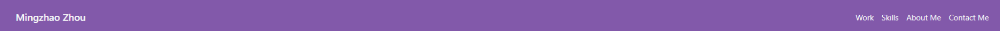
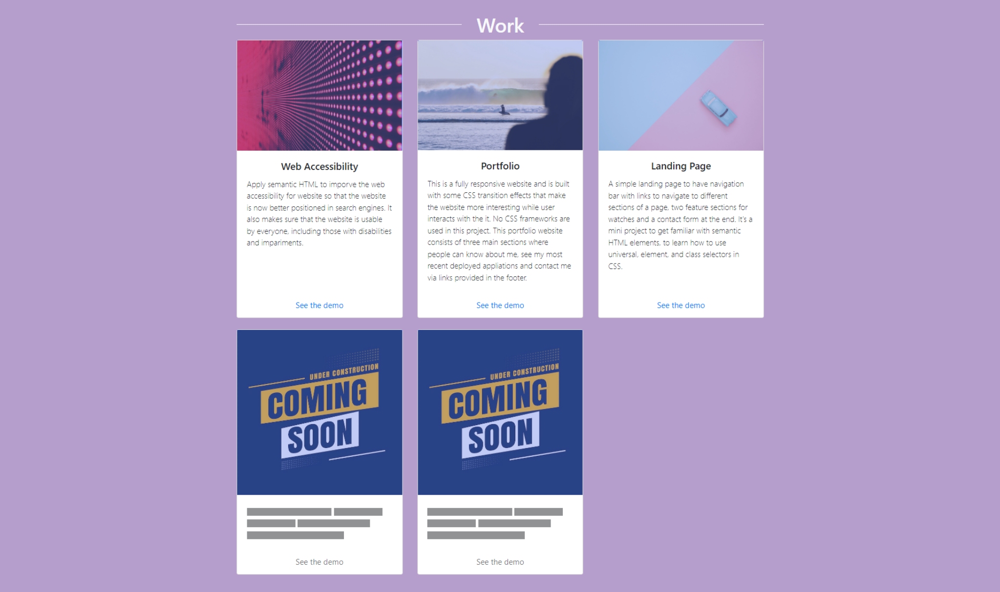

# Bootstrap Portfolio

## Description

This is a portfolio website to show to recuiters, companies and people who interest in my projects and would like to work with me in the near future. It summaries my front end development journey. The website consists of About Me, Work, skills and Contact Me sections where visitor can know about me, see my most recent deployed appliations, skills that I've learnt and contact me via links provided in the footer. It's a fully responsive website and is built with Boostrap framework and some CSS transition effects that make the website more interesting while user interacts with the it.

 

## Table of Contents

- **[The Breakdown of a Website](#breakdown)**
  - [Header](#breakdown-header)
  - [Work](#breakdown-work)
  - [Skills](#breakdown-skills)
  - [About Me](#breakdown-about-me)
  - [Contact Me](#breakdown-contact-me)
- [Deployment](#deployment)
- [Authors](#authors)
- [License](#license)

 

## The Breakdown of a Website

### Header

A stikcy header stays on top of the page when scrolling. The header contains four navigation links for different sections of the website. By clicking on the navigation links, user will be navigated to particular content of the website.

 

### Work

This section list the most recent front end projects in card representations. Each card shows the project title and brief overview about the project. Clicking on an "See the demo" button on the card will navigate user to a deployed application in a new tab.

> Work

### Skills

A list of skills I've learnt and expect to obtain from the bootcamp. Rather than describing all skills in words, each skill is repsented using its own icon with its name in a rectangle box, which gives user a clear view of skills in a first glance.

> Skills

### About Me

This section highlights my front end development experience, achievements and career objective.

> About Me

### Contact Me

This section provides email and GitHub for user to contact me and see my projects in Github.

> Contact Me

## Deployment

View my portfolio <a href="https://mingzhao91.github.io/Bootstrap-Portfolio" target="_blank">here</a>.
 

## Authors

- **Mingzhao Zhou** - <a href="https://github.com/Mingzhao91" target="_blank">Mingzhao91</a>
   

## License

This project is licensed under the MIT License.
